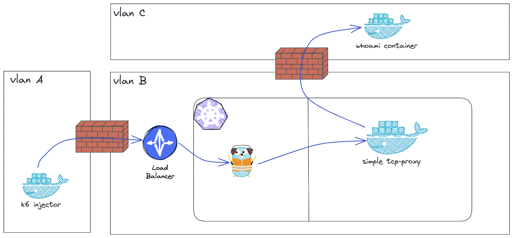

# bench-k8s-2023

L'objectif de ce repo est de pouvoir lancer un tir de performance simple sur une infra k8s connecté à une infra externe onPrem.

## Composants

- Injecteur: 1 VM avec Docker installé. Env 2CPU/8G ram.
- Stupid tcp proxy: Cluster k8s, 3 réplicas. (Accès via ingress controller)
- Hello world app: 1 VM avec Docker installé. Env 2CPU/4G ram.

Flux réseau:

- injecteur -> proxy = Via ingress http
- proxy -> hello world app = Ouverture a prévoir. Le port whoami peut être configuré.
- pas d'accès internet requis (uniquement le pull des images Docker)

### Injecteur via K6

Ne pas oublier de changer l'url pour pointer sur celle de l'ingress controller (qui fera offloading ssl)

On jonglera avec les paramètres de l'url ainsi qu'avec le nombre de v-users lors du bench:

- /wait pour ajouter de la latence (pour vérifier comment se comportent les FW avec de nombreuses session) (https://github.com/traefik/whoami#waitd)

- /data?size pour voir sur des gros payloads. (https://github.com/traefik/whoami#datasizenunitu)

Ne pas oublier de configurer le sysconf de l'injector: https://k6.io/docs/testing-guides/running-large-tests/#os-fine-tuning

Sizing mémoire: 1000VUs = 1-5GB

### Tcpproxy

A faire tourner dans le cluster K8S.

https://github.com/Tecnativa/docker-tcp-proxy

On pensera a faire pointer la var d'env TALK sur le hostname du serveur qui héberge l'application whoami

### Simple app

A faire tourner sur une VM d'un vlan legacy/

https://github.com/traefik/whoami

